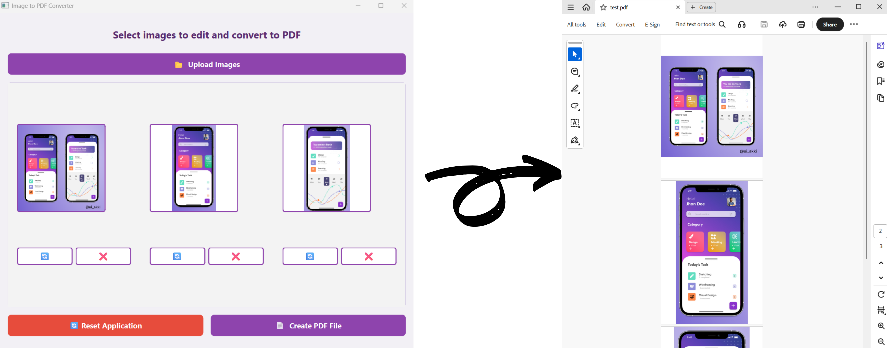

# Image-to-PDF Converter
<h1 align="center">🖼️➡️📄 Image to PDF Converter</h1> 
<h4 align="center">A modern PySide6 desktop application that allows you to upload, edit, and convert images into a high-quality PDF file. Built with <strong>Python, PySide6, and Pillow</strong>.</h4>

---

### 📑 Overview
- [Overview](#-overview)
- [Built With](#-built-with)
- [Demo](#-demo)
- [Features](#-features)
- [Setup](#-setup)
- [Bugs or Opinion](#-bugs-or-opinion)

---

### 🛠 Built With
<p>Languages and libraries used in this project:</p>

<p align="center">


</p>

---

### 🎥 Demo
A quick look at how the project works (upload → edit → convert).  
<p align="center">
🚧 *Demo image of this process will be added here...* 🚧

</p>

---

### ✨ Features
<h5>Some useful features of this app:</h5>

1. Upload multiple images at once  
2. Rotate or delete images before converting  
3. Real-time preview of uploaded images  
4. Reset the application with one click  
5. Export a clean, centered, high-quality PDF (A4 size)  
6. Beautiful modern UI with a purple theme  

---

### ⚙️ Setup
Clone the repository inside your git-enabled terminal:
```bash
git clone https://github.com/Novin1380/Multi-Image-to-PDF.git
